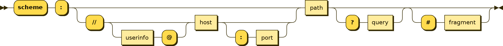

# URI interpreter C++

URI stands for Uniform Resource Identifier.

This interpreter is used to perform lexical and grammatical analysis
(lex and parse) for URIs in order to identify its components, specially to
distinguish whether the host is IPv4, IPv6, or Registered Name.

## Components

URI components:
* Scheme
* Authority
* Path
* Query
* Fragment

Where the authority's components are:
* Userinfo
* Host
* Port

And the host can be:
* IPv6
* IPv4
* Registered Name

The minimum required components are:
* Scheme
* Host ?
* Path

## Syntax

URI generic syntax:

    URI = scheme:[//authority]path[?query][#fragment]

where the authority component divides into three subcomponents:

    authority = [userinfo@]host[:port]

See the Wiki for [URI](https://en.wikipedia.org/wiki/Uniform_Resource_Identifier)

## Requirements

* CMake > 3.24
* c++20 compliant compiler
* conan 2
* Catch2

[//]: # (## CI)

[//]: # ()
[//]: # (| CI             | Platform     | Compiler |                                                                                    Build Status                                                                                    |)

[//]: # (|----------------|--------------|----------|:----------------------------------------------------------------------------------------------------------------------------------------------------------------------------------:|)

[//]: # (| Github Actions | Linux Ubuntu | gcc      |  [![linux]&#40;https://github.com/spjuanjoc/uri_interpreter_cpp/actions/workflows/linux.yml/badge.svg&#41;]&#40;https://github.com/spjuanjoc/uri_interpreter_cpp/actions/workflows/linux.yml&#41;  |)

[//]: # (| Github Actions | MacOS        | clang    | [![macos]&#40;https://github.com/spjuanjoc/uri_interpreter_cpp/actions/workflows/macosx.yml/badge.svg&#41;]&#40;https://github.com/spjuanjoc/uri_interpreter_cpp/actions/workflows/macosx.yml&#41; |)

[//]: # (| AppVeyor       | Windows      | MSVC     |                                                                                         ??                                                                                         |)
